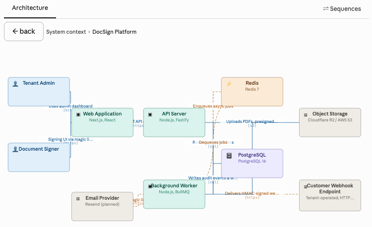
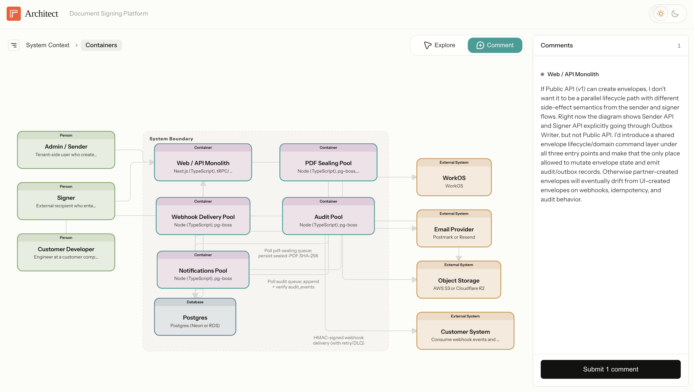
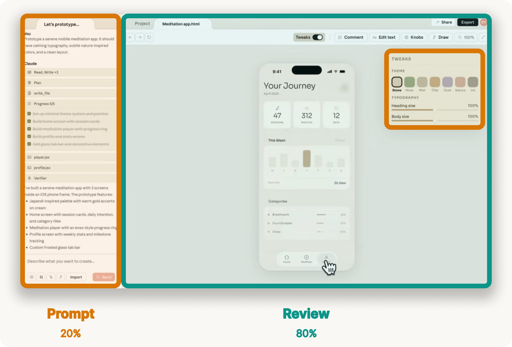
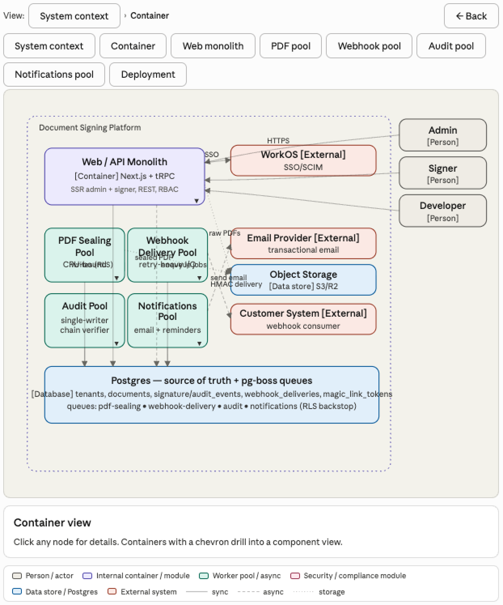
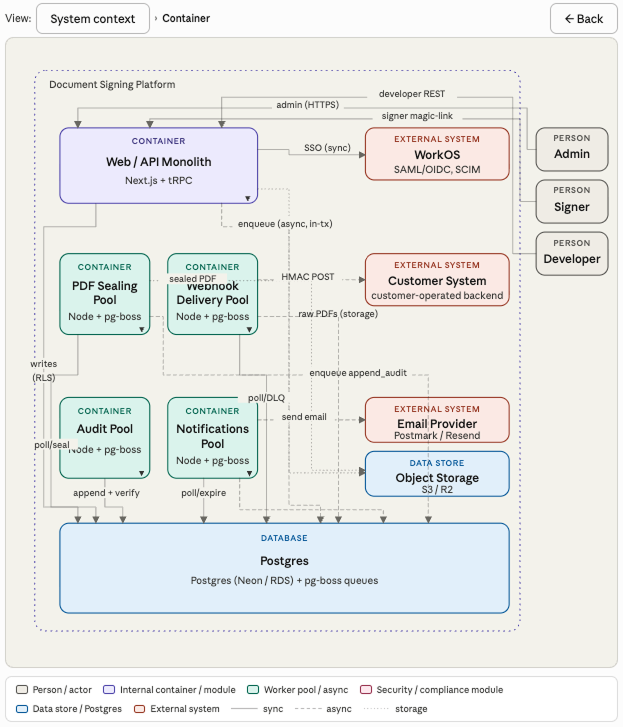

When I started building [Architect](https://willhennessy.io/writing/introducing-architect.html), I planned to use [Claude Imagine](https://claude.com/blog/claude-builds-visuals) to render the interactive architecture diagram. It can generate a periodic table, so why not a system diagram for Plan Mode?

I quickly ran into limitations.

Claude Imagine was only available in the Chat tab of the desktop app, with no way to invoke it in Claude Code. The generated diagrams also couldn't support interactive comments, which are essential to the architecture review flow. Even if those product gaps were closed, the model still struggled to format diagrams correctly. Labels collided, arrows disappeared behind boxes, and breadcrumb navigation felt clunky.

Here's one early attempt:

So I built a custom [Architect skill](https://github.com/willhennessy/architect/blob/main/skills/architect-diagram/SKILL.md) that renders architecture diagrams with clean routing and interactive comments sent directly to your local Claude Code session. The [result](https://willhennessy.io/demos/architect/document-signing) is a much cleaner review interface:

But the failed Imagine attempt left me wondering:  can Claude learn to generate review interfaces dynamically?

## Human review is becoming the bottleneck

Agents are writing code, essays, designs, and spreadsheets faster than ever. The bottleneck is no longer production, but review.

Turn-based prompts work well for simple outputs. You read the reply, type a few notes, and submit. But when Claude produces a complex artifact like a design mock, system architecture, or financial model, the review flow balloons and you can feel it. You have to:

* Identify what changed
* Decide which parts are important to review
* Reference those parts in your feedback ("change the topbar text .navbar-header to size 32px")
* Bundle several pieces of feedback together in one prompt

That cognitive load is a real bottleneck now that agents can produce drafts faster than users can review them. To help people collaborate with agents more efficiently, we need **[higher-bandwidth interfaces](https://willhennessy.io/writing/designing-agent-loops.html)** for reviewing agent work: interfaces that focus attention, attach feedback to the work, present contextual controls, and preserve escape hatches for direct editing.

Claude Design is a good example of where this is going. The prompt box gets a small slice of real estate while the interface focuses your attention on the artifact itself and invites you to comment directly on parts that need feedback.

When you orient the collaboration around the artifact, steering feels faster, prompts get shorter, and you judge the output more easily because you see it in context.

The next question is whether we need to hand-design a review interface for every domain, or whether Claude can learn to generate one based on the task at hand.

## Test case: architecture diagrams

Architecture diagrams are a useful test case: Claude already understands code, diagrams are complex but bounded, and this architecture is codified in a semantic model I can reuse across eval rounds. In this post, I test whether Claude Imagine can generate the review interface Architect needs.

For this experiment, I used the same [canonical architecture model](https://github.com/willhennessy/architect-demo-document-signing/tree/main/architecture) behind the Architect demo. This grounded the eval in a fixed architecture with explicit nodes, edges, layers, and labels.

To start, I defined a simple eval rubric with five criteria for a good architecture review interface. I weighted each one equally from 0-3, so a perfect diagram would score 15/15.

1. **Source fidelity and coverage.** Every node, edge, and label in the canonical architecture should be visible in the diagram. No element should be hallucinated. Everything should trace back to the source model.
2. **Visual integrity.** The diagram should be legible to the human eye. Nodes should not overlap, edges should route around nodes, labels should sit in clear space, and colors should encode meaning consistently.
3. **Information density.** The canvas should show structure, not become documentation. Related nodes should sit near each other, and node boxes should present only essential information: type, name, and technology.
4. **Interaction coherence.** The C4 hierarchy should be clear. Users should be able to drill down into containers and navigate back with breadcrumbs. Each click target should have one predictable behavior.
5. **Reviewability.** The diagram should be fast enough to support iteration between the agent and the user. Rendering time matters, but so does whether failures are easy to spot and fix.

I used this rubric to evaluate each turn of the iteration with Claude.

## The first draft failed in useful ways

I began with a detailed prompt asking Claude to render the document signing architecture with layout rules, data boundaries, and interactive drill-down behavior.

The first result was functionally correct, but visually cluttered. Edges crossed through unrelated nodes. Labels collided. Boxes carried too much text. Navigation buttons cluttered the UI. Score: 6/15.

I asked Claude why it missed such obvious edge routing problems. Its answer was insightful:

> I didn't actually verify the routing. I treated "draw an arrow from A to B" as a one-step problem and eyeballed the waypoints instead of reserving channels. The original prompt didn't ask me to verify my own work, so I didn't.

Claude knew many of the right design principles, but it was not applying them as constraints. I needed to codify more rules, so I spent the next hour coaching Claude through the failure modes.

## What improved the diagram

The most useful part of the experiment was watching the failure mode shift from rendering to judgment.

**1. Layout had to become global.** Claude originally treated each edge as its own drawing problem: connect A to B with a line, but routing is a global problem. Nodes need to be placed first, empty channels need to be reserved between groups, and then every edge needs to route through those channels. Once Claude adopted that strategy, most of the edge collisions disappeared. Score: 8/15.

**2. Label placement needed verification too.** After the edge routing improved, labels still collided. The root cause was similar. Claude placed labels relative to individual edges instead of checking the global set of labels and nodes. I asked it to relocate each label into clear space with explicit offsets per lane and that made labels legible. Score: 9/15.

**3. Information density required domain taste.** Claude was putting far too much information inside each box. This is where the experiment got interesting. Once I gave Claude a strict rule: type, name, technology, and nothing else, it cleaned up the canvas quickly. But writing that rule required judgment about what information *actually matters* to a software engineer.

This will be a central problem for dynamic interface design. Claude can follow layout instructions, but great interfaces require taste and judgment. We will need to train Claude on domain judgment: what information deserves attention, which controls take priority, and what should be hidden below the fold.

**4. Reduce app chrome.** Claude added a row of view-selector buttons, a static "major uncertainties" paragraph, and a sources block at the bottom. All of that competed with the diagram. Breadcrumbs were enough navigation when drill-down was obvious. Removing unnecessary chrome made the surface feel more like a review interface and less like a generated report. Score: 12/15.

**5. Interactions needed more specification.** The final issue was the details panel. Claude originally rendered it as a static block below the diagram, which forced the user to scroll away from the artifact to read details. I asked for a sidebar that animates in from the right, overlaid on the canvas, with a close button. Claude then attached the side panel to elements that were supposed to drill down, creating two behaviors for one click. I had to specify the interaction contract: drillable nodes drill down; leaf nodes open details.

By the end, Claude was consistently producing diagrams that scored 12/15 on the rubric.

## The hard part is not drawing

Claude is better at generating interfaces than I expected. With a rubric, a forced verification pass, and domain-specific content rules, it can produce architecture diagrams that are genuinely useful for review.

The real challenge is deeper than rendering. Great interfaces require product judgment to know what information and controls actually matter in each domain. Claude can learn some of this over time, but it will take active product development in each vertical. Some of that judgment will form patterns that transfer across domains, but the work probably starts one workflow at a time.

To get there, a few things need to improve:

- **Domain judgment:** Claude needs to learn the rules of each domain so it can design interfaces with real craft.
- **Rendering time:** each architecture diagram took around 10 minutes to render, which is too slow for a live steering loop. The next generation of models needs to generate interactive visuals more quickly.
- **Workflow integration:** review interfaces should live inside the workflow. For architecture review, that means Claude Code. The user should be able to generate a system diagram inside Plan Mode, review it in a browser, and send feedback back to Claude. [Architect](https://willhennessy.io/writing/introducing-architect.html) proves the loop is useful, but native integration would make it much better.

Claude Design is interesting because it orients the entire conversation around the artifact. Chat is present, but the primary surface is the design itself. The product helps you review Claude's work more quickly with domain-specific controls and comments directly on the design. That's a winning pattern for agent interfaces, and I expect to see more of it this year.

I'm excited to build more of these interfaces: the surfaces, rubrics, and feedback paths that let human judgment shape agent work at higher bandwidth. If you're working on this, say hello.
