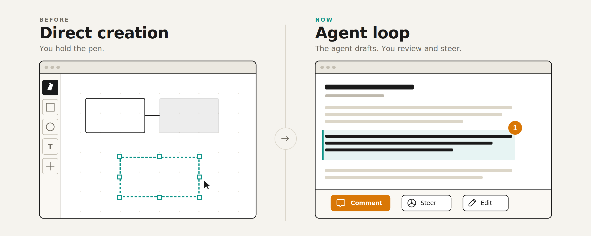
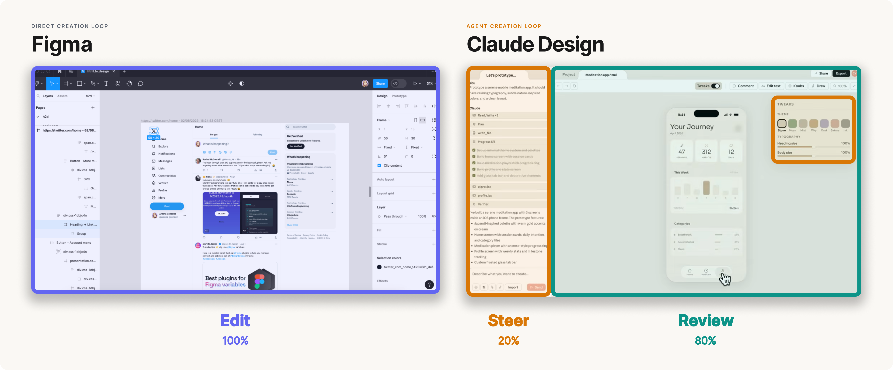

## From pens to steering wheels

Most software interfaces were designed for direct manipulation. You draw rectangles in Figma, write code in VSCode, and move boxes in PowerPoint until it looks right.

Agent interfaces start from a different assumption: agents manipulate the content while humans review and steer each iteration. This changes the role of the interface from a pen to a steering wheel.

For example, compare Figma to Claude Design.

You can see the same pattern in coding tools, slide decks, finance workflows, and other domains. Instead of exposing every manual control upfront, these interfaces focus the user's attention on the agent's output and help them steer the next iteration.

## Steer, review, repeat

Agent interfaces follow a simple pattern: steer, review, repeat. 

The user gives the agent direction. The agent goes off and produces a draft. The user reviews the output, applies their own judgment or taste, and gives more specific feedback. The agent tries again and the cycle repeats until the user is satisfied.

That back-and-forth sounds like chat, but the interface problem is much bigger than a text box. The product needs to help the user understand what the agent did, decide what deserves attention, and give feedback in the right place. 

That's why the right interface looks different in every domain. Design agents need to render a canvas. Coding agents need to render PRs or architecture diagrams. Finance agents need to render spreadsheets.

This makes interfaces more important, not less. As agents take on more of the work, each human interaction becomes more leveraged. Better models will get closer on the first try, but they are still pulled toward high-probability answers. The best products will help people create work that rises above the average by pulling human taste, context, and judgment into the loop at the right moments.

## Principles for High-Bandwidth Interfaces

If the core loop is an iterative conversation with agents, then the job of the interface is to increase communication bandwidth. A few design principles follow from that goal.

1. **Focus attention where judgment is needed.** Bandwidth does not mean showing the user more information. It means directing attention to the places where human judgment can have the highest impact, without making the user inspect everything the agent touched. The interface should distill a large amount of work into a small number of high-signal review moments. If the work is complex, simplify it with a diagram, table, or visual diff.
2. **Attach feedback to the work.** Once the interface has brought the right part of the work into focus, the user should be able to comment directly on it. Whether that's a line of code, an architecture diagram, a design mock, or a spreadsheet, feedback should land on the thing itself. This lets the user judge the work with full context in view, and helps the agent see exactly what should change. It also lowers friction because the user doesn't need to specify context in every chat message.
3. **Match steering controls to the context.** Not every review moment needs the same controls. The useful actions depend on what part of the work is in focus and what kind of judgment it requires. A design review might need controls for density, layout, and tone whereas a code review might need controls to run tests or explain a diff. The goal is to give the user a small set of steering options that fit the moment, without making them reinvent every instruction from scratch.
4. **Let the user pick up the pen.** Focused attention and contextual controls create a guided path through the work, but sometimes the agent gets it wrong or the user sees a better version. The interface needs two escape hatches:  chat for broad steering when the agent goes off course, and edit mode for moments when the user wants to author the work directly.

## Interfaces for Every Shape of Work

The role of interfaces is shifting from direct creation to steering loops. The best products will help humans guide agent work with high bandwidth: focused attention, contextual steering, and escape hatches to take direct control.

Since agents produce different types of work across turns and domains, fixed interfaces will not be enough. The interface will need to compose itself around each turn of the conversation, tailored to the task at hand but stable enough that the user never feels lost.
