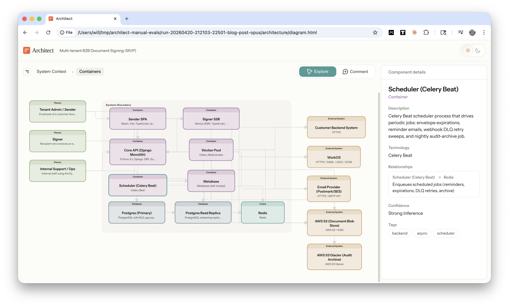
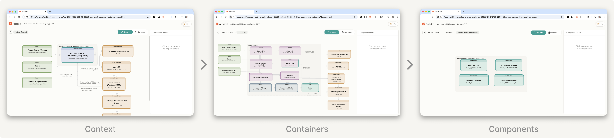
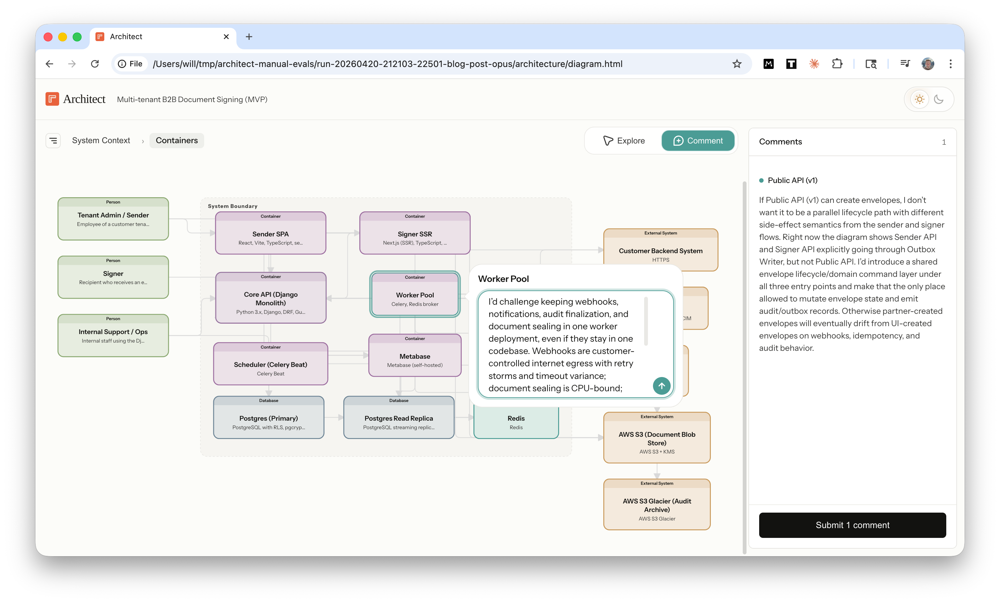
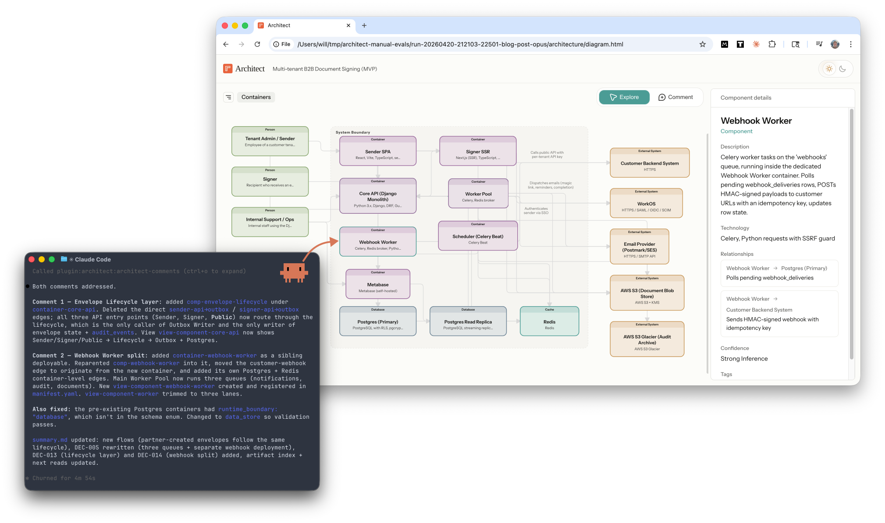

I'm excited to launch Claude Architect, a plugin that turns Plan Mode into a collaborative architecture review with Claude.

Architect renders any Claude Code plan as an interactive diagram so you can see the whole system at a glance, comment directly on components, and refine the architecture with Claude before any code is written.

<div style="padding:56.25% 0 0 0;position:relative;"><iframe src="https://player.vimeo.com/video/1189608717?badge=0&amp;autopause=0&amp;player_id=0&amp;app_id=58479" frameborder="0" allow="autoplay; fullscreen; picture-in-picture; clipboard-write; encrypted-media; web-share" referrerpolicy="strict-origin-when-cross-origin" style="position:absolute;top:0;left:0;width:100%;height:100%;" title="Claude Architect"></iframe></div><script src="https://player.vimeo.com/api/player.js"></script>

## Steering agents in production systems

Coding agents can one-shot a prototype, but when you're building a production system they need a lot of steering. That means you're writing long prompts or providing many rounds of feedback to convey requirements like:

- **cross-component context**: "after refactoring Component A, go update Component B which calls it"
- **production constraints**: "add a load balancer here" or "put a cache there"
- **confidence checks**: "will this actually hold up at 50 QPS in prod?"

After a full day of back-and-forth in the terminal, that overhead starts to feel like its own job.

## Diagrams: a better interface for system design

What if Plan Mode felt more like a whiteboard session?

Whiteboards are a great tool for system design because you can quickly grok the entire architecture, spot relationships that are easy to miss in text, and debate specific components in the context of the whole system.


_A good whiteboard session quickly surfaces the most important design decisions_

## Steering agents through diagrams

The Claude Architect [plugin](https://github.com/willhennessy/architect) simulates that experience by extending Plan Mode with an interactive architecture diagram. The visual canvas makes it much easier to review, annotate, and revise the plan with Claude in real time.

{.no-border}

The steering loop feels like a whiteboard session:

1. **review the architecture** and see relationships at a glance
2. **drill down** into containers and components to review each layer
3. **comment directly** on any node or edge
4. **review updates** from Claude in response to your comments

Under the hood, Claude builds a semantic model of the system architecture using the [C4 model](https://c4model.com/abstractions), writes it to structured [YAML files](https://github.com/willhennessy/architect-demo-document-signing/tree/main/architecture), and renders those files in an interactive diagram. Your comments are sent back to Claude through a local [Channel](https://code.claude.com/docs/en/channels), and then Claude updates both the plan and diagram in real time.

You interact with a visual diagram and Claude reads structured YAML files.

## Demo

Let's walk through a demo. We'll design a new multi-tenant B2B document-signing platform.

### 1. Start planning

Switch to Plan Mode and give Claude your requirements.

{.no-border}

Claude writes the plan as usual, and then asks

```Do you want to review an interactive architecture diagram?```

Yes.

### Review the diagram

Claude generates the diagram and opens it in your browser. You can inspect nodes to see more detail, hover over edges to see their function, and drill down into four layers: context, containers, components, and code.

Try the [live demo](https://willhennessy.io/demos/architect/document-signing) for yourself!



### Comment on the diagram

Toggle on Comment mode \(C) to add feedback directly to any node or edge in the architecture. Each comment is associated with the element ID so Claude receives your feedback in context.

{.no-border}

### Claude incorporates your feedback

Claude receives your comments through a Channel, processes them in the terminal, updates the plan doc, and re-renders the diagram with your feedback. This isn’t limited to small tweaks either: Claude can add new components, refactor containers, or rewrite the entire system.

{.no-border}

_Claude addressed my comment by splitting the webhook worker into a separate container with its own queue budget_

## Beyond planning

You exit Plan Mode with two durable artifacts.

- **Structured YAML files** encode your architecture in an agent-readable format. Next, I'm going to research if these files help agents work more effectively in large scale codebases.
- **Visual diagrams** illustrate your architecture in human-readable format to help your teammates operate with the full system in view.

Text for agents; diagrams for humans.

## High bandwidth interfaces

The [design principle](https://willhennessy.io/writing/designing-agent-loops.html) behind Architect is to increase the **communication bandwidth** between you and Claude.

By bandwidth, I mean how much context can flow between the engineer and the agent per unit of effort. Simple projects require very little bandwidth; a short prompt is often enough. Large production systems need much higher bandwidth to communicate system boundaries, production constraints, real-world edge cases, and risks that an experienced engineer knows to look for.

Architecture diagrams increase read bandwidth. Instead of paging through a long text plan, you can see the system at a glance, understand the major relationships, and spot the high-leverage places to direct your attention with less cognitive load.

Interactive comments increase write bandwidth. Instead of restating component names in every round of chat, you can comment directly on the node. A fully interactive canvas would unlock even more bandwidth.

Agents give you leverage, but interfaces determine how much of it you can actually use. Legible plans make the important decisions easier to spot. In-context feedback lowers the friction of steering. The result is a faster, tighter iteration loop between you and Claude.

## What's next

Powerful models have made chat interfaces feel magical, but this prototype was a reminder that interface design still matters because agents perform much better when humans understand the plan and steer it well. Last week's Claude Design launch is another good example of how much interface design can shape agent performance. I expect a lot more experimentation in agent interfaces this year.

Next, I'll be adding more features:

1. Comment threads for back-and-forth discussion with Claude on tricky comments
2. Architect subagents to review the diagram with domain expertise, like Security, and add comments directly on the diagram
3. Edit mode: add, delete, drag, and edit

And exploring some research hypotheses:

1. Does the semantic architecture model help agents navigate large codebases more effectively?
2. Can we use the architecture model to establish guardrails that mitigate architecture drift as agents layer on new functionality over time?

## Try it out

Install the [architect plugin](https://github.com/willhennessy/architect/tree/main):

```bash
claude plugin marketplace add https://github.com/willhennessy/architect.git
claude plugin install architect@plugins
```

Run Claude with a flag to enable the comments [Channel](https://code.claude.com/docs/en/channels):

```bash
claude --dangerously-load-development-channels plugin:architect@plugins
```

Then switch to plan mode and invoke the architect skill:

```bash
/architect:plan <prompt>
```

Or generate a diagram for your existing codebase with `/architect:init`

I'd love to [hear your feedback](https://x.com/WillHennessy_). How accurate was the architecture? What comments did you give Claude? What features do you want to see next?
