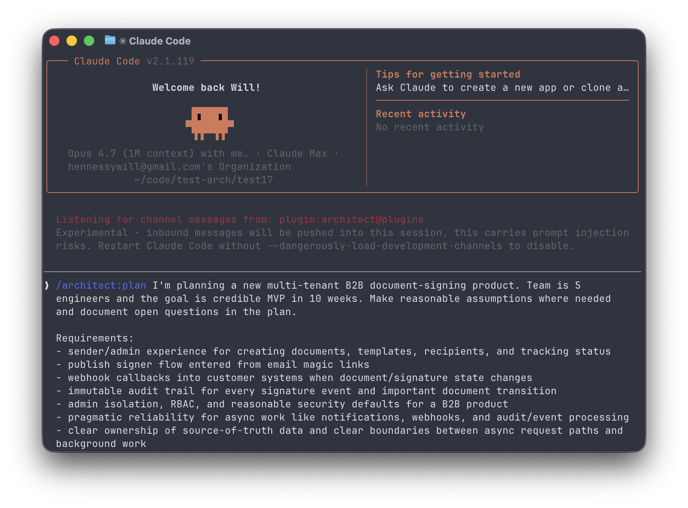

## Steering in large scale codebases

Coding agents can one-shot a prototype, but when you're building a production system they need a lot of steering. That steering usually falls into three buckets:

  - **cross-component context**: "after changing ComponentA, go update ComponentB which calls it"
  - **production requirements**: "add a load balancer here" or "put a cache in front of this"
  - **confidence checks**: "will this actually hold up at 50 QPS in prod?"

The local implementation is often fine. The hard part is transferring full system context and production constraints from your head into the agent’s context, then enforcing them as it builds. After a full day of back-and-forth in the terminal, that overhead starts to feel like its own job. 

## Diagrams: a better interface for system design

Whiteboards are a great tool to design complex systems. You can sketch a complete picture of the system, see relationships that are easy to miss in text, and debate specific components in context of the whole system. You usually leave with clear decisions and a coherent architecture. 


*A good whiteboard session quickly surfaces the most important design decisions*

## Steering agents through diagrams

I built the Claude Architect [plugin](https://github.com/willhennessy/architect) to make Plan Mode feel more like a whiteboard session. The plugin generates an interactive architecture diagram during Plan Mode so you can review, annotate, and revise the plan with Claude in real time.


The steering loop feels like a whiteboard session:

1. **review the architecture** and see relationships at a glance
2. **drill down** into containers and components to review each layer
3. **comment directly** on any node or edge
4. **review updates** from Claude in response to your comments

Under the hood, Claude generates a semantic model of the system architecture using the [C4 model](https://c4model.com/abstractions), writes it to structured YAML files, and renders those files in an interactive diagram. Your comments are sent back to Claude through a local [Channel](https://code.claude.com/docs/en/channels), and then Claude updates both the plan and diagram in real time.

You interact with a visual diagram and Claude reads structured YAML files.

## Demo

Let's walk through a demo. We'll design a new multi-tenant B2B document-signing platform.

### 1. Start planning

Switch to Plan Mode and give Claude your requirements. 

Claude writes the plan as usual, and then asks

> *Do you want to review an interactive architecture diagram?*
> Yes.


### Review the diagram

Claude generates the diagram and opens it in your browser. You can inspect nodes to see more detail, hover over edges to see their function, and drill down into four layers:  context, containers, components, and code.


### Comment on the diagram

Toggle on Comment mode \(C) to add feedback directly to any node or edge in the architecture. Each comment is associated with the element ID so Claude receives your feedback in context.


### Claude incorporates your feedback

Claude receives your comments through a Channel, processes them in the terminal, updates the plan doc, and re-renders the diagram with your feedback. This isn’t limited to small tweaks either: Claude can add new components, refactor containers, or rewrite the entire system.


*Claude addressed my comment by splitting the webhook worker into a separate container with its own queue budget*

## Beyond planning

You exit Plan Mode with two durable artifacts.

* **Structured YAML files** encode your architecture in an agent-readable format. Next, I'm going to research if these files help agents work more effectively in large scale codebases.
* **Visual diagrams** illustrate your architecture in human-readable format to help your teammates operate with the full system in view.

Text for agents; diagrams for humans.

## High bandwidth interfaces

The design principle behind Architect is to increase the **communication bandwidth** between you and Claude.

By bandwidth, I mean how much context can flow between the engineer and the agent per unit of effort. Simple projects require very little bandwidth; a short prompt is often enough. Large production systems need much higher bandwidth to communicate system boundaries, production constraints, real-world edge cases, and risks that an experienced engineer knows to look for. 

Architecture diagrams increase read bandwidth. Instead of paging through a long text plan, you can see the system at a glance, understand the major relationships, and spot the high-leverage places to direct your attention with less cognitive load.

Interactive comments increase write bandwidth. Instead of restating component names in every round of chat, you can comment directly on the node. A fully interactive canvas would unlock even more bandwidth.

Agents give you leverage, but interfaces determine how much of it you can actually use. Legible plans make the important decisions easier to spot. In-context feedback lowers the friction of steering. The result is a faster, tighter iteration loop between you and Claude.

## What's next

Powerful models have made chat interfaces feel magical, but this prototype was a reminder that interface design still matters because agents perform much better when humans understand the plan and steer it well. Last week's Claude Design launch is another good example of how much interface design can shape agent performance. I expect a lot more experimentation in agent interfaces this year. 

Next, I'll be adding more features and exploring research questions:

1. What parts of Plan Mode are better done in a diagram vs. a text doc?
2. Does the codified architecture model help coding agents operate more effectively in large codebases by providing a high level map of the system? 
3. Can we use the architecture model to establish useful guardrails that mitigate architecture drift as agents operate in large codebases?

## Try it out

Install the [architect plugin](https://github.com/willhennessy/architect/tree/main):

```bash
claude plugin marketplace add https://github.com/willhennessy/architect.git
claude plugin install architect@plugins
```

Run Claude with a flag to enable the comments [Channel](https://code.claude.com/docs/en/channels):

``` bash
claude --dangerously-load-development-channels plugin:architect@plugins
```

Then switch to plan mode and invoke the architect skill:

``` bash
/architect:plan <prompt>
```

If you want to generate a diagram for your existing codebase, run `/architect:init`

I'd love to [hear your feedback](https://x.com/WillHennessy_). How accurate was the architecture? What comments did you give Claude? What features do you want to see next?